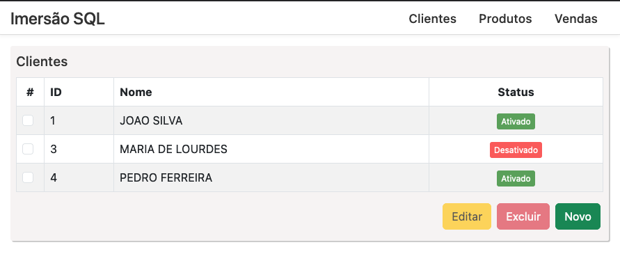

# Imersão SQL


Desenvolvi esse projeto como parte do evento Imersão SQL, que organizei enquanto era EmbaixaTrybe na escola Trybe. A aplicação utiliza tecnologias como Docker, React, JavaScript, CSS, HTML, Bootstrap, Node.js, Express e um banco de dados relacional.

O objetivo principal do evento era aprofundar os conhecimentos em SQL, por meio de uma abordagem prática. Através dessa aplicação full stack, foi possível explorar como a comunicação e utilização de um banco de dados são essenciais no desenvolvimento de uma aplicação. Os participantes puderam aprender sobre operações de CRUD, cadastro de clientes, produtos e realização de vendas.

Neste repositório, você encontrará o código-fonte completo, bem como instruções detalhadas sobre como configurar e executar a aplicação localmente. Espero que seja útil para aqueles que desejam aprofundar seus conhecimentos em desenvolvimento de aplicações web, especialmente no contexto de interação com bancos de dados. Sinta-se à vontade para explorar, contribuir e fornecer feedback.



## Pré-requisitos

- Docker instalado: [Instruções de instalação do Docker](https://docs.docker.com/get-docker/)

## Passos para execução

1. Faça o clone do projeto em sua máquina.

   ```bash
   git clone git@github.com:vsalisbr/imersaosql.git
   ```

2. Pelo terminal, navegue até a pasta raiz do projeto onde se encontra o arquivo `docker-compose.yml`.

   ```bash
   cd imersaosql
   ```

3. Execute o seguinte comando para construir e executar os contêineres do projeto em segundo plano:

   ```bash
   docker-compose up -d --build
   ```

   Isso criará e iniciará os contêineres definidos no arquivo `docker-compose.yml`.

4. Para a aplicação funcionar corretamente é obrigatório criar o banco de dados executando o seguinte comando:

   ```bash
   docker exec imersaosql-database-1 /usr/local/firebird/bin/isql -q -i /tmp/criar_banco.sql
   ```

   Este comando executa um script SQL para criar o banco de dados inicial da aplicação no contêiner do banco de dados. É importante destacar que o banco da aplicação fica salvo em um volume, então você não precisa recriá-lo a cada execução.

Após a conclusão desses passos, o projeto estará em execução com os contêineres configurados corretamente.

Acesse o frontend em: http://localhost:9080/

## Contato

- Email <vsalis@live.com>
- Linkedin <https://linkedin.com/in/vsalis/>

## Licença

[MIT](LICENSE) Copyright (c) 2023, Victor Salis Muniz.
